# Pictogram Dataset for Anonymous Review

To maintain the double-blind review process, all personal identifiers and file metadata have been completely stripped.

## 📊 Dataset Specifications
* **Total Pictograms:** 330
* **Format:** .JPG
* **Directory Structure:** All pictograms are available in the `/data` folder.

## 🏷️ File Naming Convention
Each pictogram in this dataset follows a structured naming pattern:

```text
{concept}_{condition_map}_{ranking}.ext
```

Where each field represents:
* **concept**: The concept represented by the pictogram (e.g., Ajolote).
* **condition_map**: The conditioning map used to generate the pictogram (e.g., canny).
* **ranking**: The rank obtained by the pictogram in the survey conducted to select the best pictogram among three alternatives (where 1 represents the highest-voted option).

**Remark.** Filenames corresponding to tied pictograms generated with the same condition map include the suffix `_dup` (e.g., `Bread_canny_1_dup.jpg`).

## 🖼️ Full Dataset Gallery
Below is the complete collection of pictograms included in this dataset:

<table>
  <tr>
    <td align="center" valign="bottom">
      <br>
      <code>Ajolote_canny_1.jpg</code>
    </td>
    <td align="center" valign="bottom">
      <br>
      <code>Ajolote_canny_2.jpg</code>
    </td>
    <td align="center" valign="bottom">
      <br>
      <code>Ajolote_canny_3.jpg</code>
    </td>
  </tr>
  <tr>
    <td align="center" valign="bottom">
      <br>
      <code>Angry_depth_1.jpg</code>
    </td>
    <td align="center" valign="bottom">
      <br>
      <code>Angry_depth_2.jpg</code>
    </td>
    <td align="center" valign="bottom">
      <br>
      <code>Angry_seg_1.jpg</code>
    </td>
  </tr>
  <tr>
    <td align="center" valign="bottom">
      <br>
      <code>Baby_depth_1.jpg</code>
    </td>
    <td align="center" valign="bottom">
      <br>
      <code>Baby_depth_2.jpg</code>
    </td>
    <td align="center" valign="bottom">
      <br>
      <code>Baby_depth_3.jpg</code>
    </td>
  </tr>
  <tr>
    <td align="center" valign="bottom">
      <br>
      <code>Bad_canny_2.jpg</code>
    </td>
    <td align="center" valign="bottom">
      <br>
      <code>Bad_canny_3.jpg</code>
    </td>
    <td align="center" valign="bottom">
      <br>
      <code>Bad_depth_1.jpg</code>
    </td>
  </tr>
  <tr>
    <td align="center" valign="bottom">
      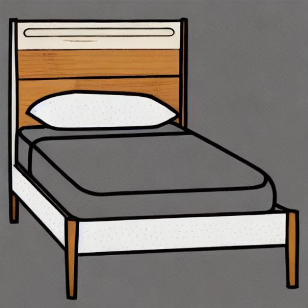<br>
      <code>Bed_canny_2.jpg</code>
    </td>
    <td align="center" valign="bottom">
      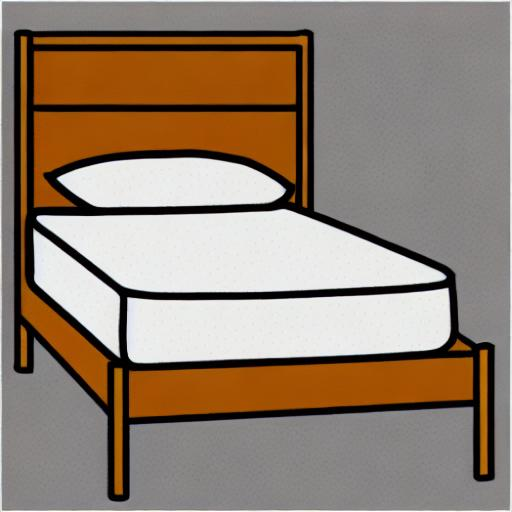<br>
      <code>Bed_depth_3.jpg</code>
    </td>
    <td align="center" valign="bottom">
      <br>
      <code>Bed_hed_1.jpg</code>
    </td>
  </tr>
  <tr>
    <td align="center" valign="bottom">
      <br>
      <code>Book_canny_2.jpg</code>
    </td>
    <td align="center" valign="bottom">
      <br>
      <code>Book_canny_3.jpg</code>
    </td>
    <td align="center" valign="bottom">
      <br>
      <code>Book_depth_1.jpg</code>
    </td>
  </tr>
  <tr>
    <td align="center" valign="bottom">
      <br>
      <code>Bored_canny_1.jpg</code>
    </td>
    <td align="center" valign="bottom">
      <br>
      <code>Bored_depth_2.jpg</code>
    </td>
    <td align="center" valign="bottom">
      <br>
      <code>Bored_depth_3.jpg</code>
    </td>
  </tr>
  <tr>
    <td align="center" valign="bottom">
      <br>
      <code>Bread_canny_1.jpg</code>
    </td>
    <td align="center" valign="bottom">
      <br>
      <code>Bread_canny_1_dup.jpg</code>
    </td>
    <td align="center" valign="bottom">
      <br>
      <code>Bread_depth_1.jpg</code>
    </td>
  </tr>
  <tr>
    <td align="center" valign="bottom">
      <br>
      <code>Brother_openpose_1.jpg</code>
    </td>
    <td align="center" valign="bottom">
      <br>
      <code>Brother_seg_2.jpg</code>
    </td>
    <td align="center" valign="bottom">
      <br>
      <code>Brother_seg_3.jpg</code>
    </td>
  </tr>
  <tr>
    <td align="center" valign="bottom">
      <br>
      <code>Brush_teeth_canny_2.jpg</code>
    </td>
    <td align="center" valign="bottom">
      <br>
      <code>Brush_teeth_depth_3.jpg</code>
    </td>
    <td align="center" valign="bottom">
      <br>
      <code>Brush_teeth_hed_1.jpg</code>
    </td>
  </tr>
  <tr>
    <td align="center" valign="bottom">
      <br>
      <code>Bus_canny_2.jpg</code>
    </td>
    <td align="center" valign="bottom">
      <br>
      <code>Bus_hed_1.jpg</code>
    </td>
    <td align="center" valign="bottom">
      <br>
      <code>Bus_hed_3.jpg</code>
    </td>
  </tr>
  <tr>
    <td align="center" valign="bottom">
      <br>
      <code>Calm_canny_2.jpg</code>
    </td>
    <td align="center" valign="bottom">
      <br>
      <code>Calm_canny_3.jpg</code>
    </td>
    <td align="center" valign="bottom">
      <br>
      <code>Calm_depth_1.jpg</code>
    </td>
  </tr>
  <tr>
    <td align="center" valign="bottom">
      <br>
      <code>Car_canny_1.jpg</code>
    </td>
    <td align="center" valign="bottom">
      <br>
      <code>Car_depth_1.jpg</code>
    </td>
    <td align="center" valign="bottom">
      <br>
      <code>Car_seg_2.jpg</code>
    </td>
  </tr>
  <tr>
    <td align="center" valign="bottom">
      <br>
      <code>Chair_canny_1.jpg</code>
    </td>
    <td align="center" valign="bottom">
      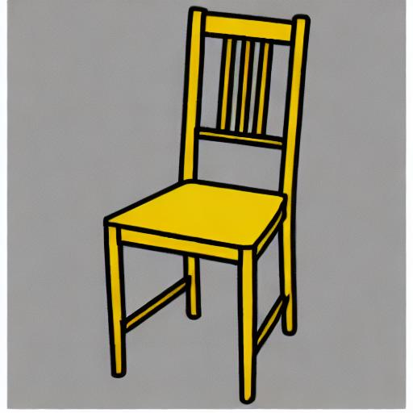<br>
      <code>Chair_depth_1.jpg</code>
    </td>
    <td align="center" valign="bottom">
      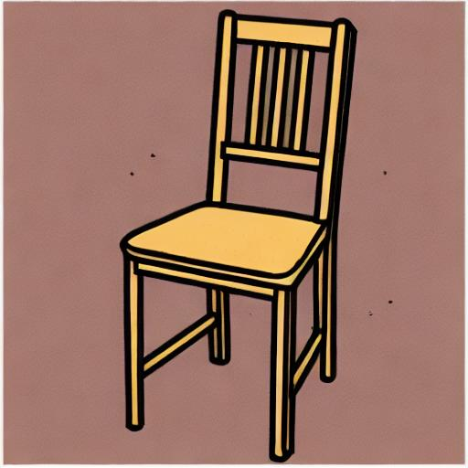<br>
      <code>Chair_hed_2.jpg</code>
    </td>
  </tr>
  <tr>
    <td align="center" valign="bottom">
      <br>
      <code>Champurrado_canny_1.jpg</code>
    </td>
    <td align="center" valign="bottom">
      <br>
      <code>Champurrado_depth_2.jpg</code>
    </td>
    <td align="center" valign="bottom">
      <br>
      <code>Champurrado_hed_3.jpg</code>
    </td>
  </tr>
  <tr>
    <td align="center" valign="bottom">
      <br>
      <code>Chichen_itza_canny_1.jpg</code>
    </td>
    <td align="center" valign="bottom">
      <br>
      <code>Chichen_itza_canny_2.jpg</code>
    </td>
    <td align="center" valign="bottom">
      <br>
      <code>Chichen_itza_depth_1.jpg</code>
    </td>
  </tr>
  <tr>
    <td align="center" valign="bottom">
      <br>
      <code>Close_depth_1.jpg</code>
    </td>
    <td align="center" valign="bottom">
      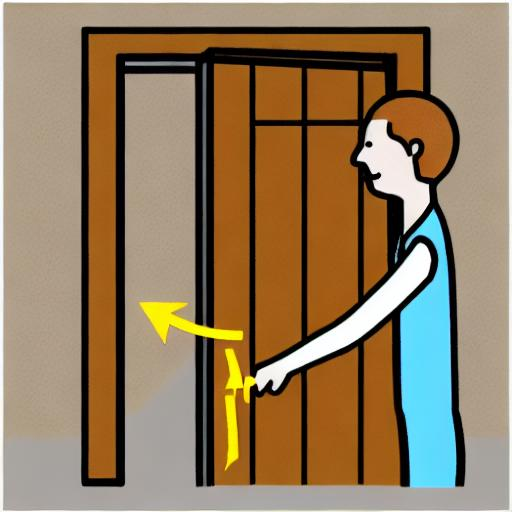<br>
      <code>Close_depth_2.jpg</code>
    </td>
    <td align="center" valign="bottom">
      <br>
      <code>Close_depth_2_dup.jpg</code>
    </td>
  </tr>
  <tr>
    <td align="center" valign="bottom">
      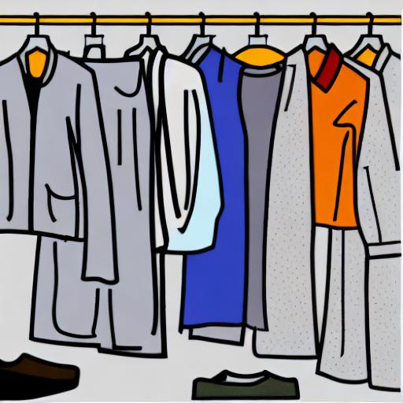<br>
      <code>Clothes_depth_3.jpg</code>
    </td>
    <td align="center" valign="bottom">
      <br>
      <code>Clothes_seg_1.jpg</code>
    </td>
    <td align="center" valign="bottom">
      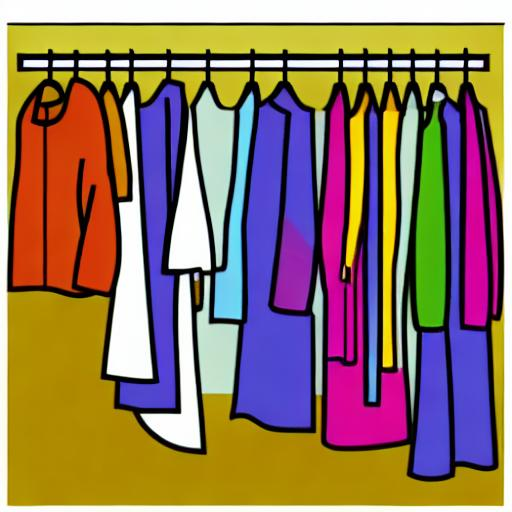<br>
      <code>Clothes_seg_2.jpg</code>
    </td>
  </tr>
  <tr>
    <td align="center" valign="bottom">
      <br>
      <code>Come_depth_1.jpg</code>
    </td>
    <td align="center" valign="bottom">
      <br>
      <code>Come_depth_2.jpg</code>
    </td>
    <td align="center" valign="bottom">
      <br>
      <code>Come_hed_2.jpg</code>
    </td>
  </tr>
  <tr>
    <td align="center" valign="bottom">
      <br>
      <code>Dia_de_muertos_canny_1.jpg</code>
    </td>
    <td align="center" valign="bottom">
      <br>
      <code>Dia_de_muertos_canny_2.jpg</code>
    </td>
    <td align="center" valign="bottom">
      <br>
      <code>Dia_de_muertos_depth_3.jpg</code>
    </td>
  </tr>
  <tr>
    <td align="center" valign="bottom">
      <br>
      <code>Doctor_canny_1.jpg</code>
    </td>
    <td align="center" valign="bottom">
      <br>
      <code>Doctor_depth_2.jpg</code>
    </td>
    <td align="center" valign="bottom">
      <br>
      <code>Doctor_depth_3.jpg</code>
    </td>
  </tr>
  <tr>
    <td align="center" valign="bottom">
      <br>
      <code>Draw_canny_1.jpg</code>
    </td>
    <td align="center" valign="bottom">
      <br>
      <code>Draw_canny_2.jpg</code>
    </td>
    <td align="center" valign="bottom">
      <br>
      <code>Draw_hed_1.jpg</code>
    </td>
  </tr>
  <tr>
    <td align="center" valign="bottom">
      <br>
      <code>Drink_depth_1.jpg</code>
    </td>
    <td align="center" valign="bottom">
      <br>
      <code>Drink_depth_3.jpg</code>
    </td>
    <td align="center" valign="bottom">
      <br>
      <code>Drink_hed_2.jpg</code>
    </td>
  </tr>
  <tr>
    <td align="center" valign="bottom">
      <br>
      <code>Eat_canny_3.jpg</code>
    </td>
    <td align="center" valign="bottom">
      <br>
      <code>Eat_hed_1.jpg</code>
    </td>
    <td align="center" valign="bottom">
      <br>
      <code>Eat_hed_2.jpg</code>
    </td>
  </tr>
  <tr>
    <td align="center" valign="bottom">
      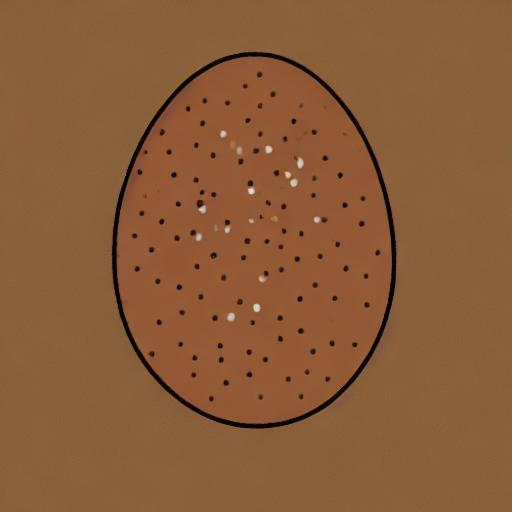<br>
      <code>Egg_canny_3.jpg</code>
    </td>
    <td align="center" valign="bottom">
      <br>
      <code>Egg_depth_1.jpg</code>
    </td>
    <td align="center" valign="bottom">
      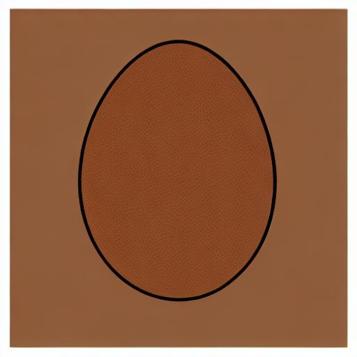<br>
      <code>Egg_depth_2.jpg</code>
    </td>
  </tr>
  <tr>
    <td align="center" valign="bottom">
      <br>
      <code>Excited_canny_3.jpg</code>
    </td>
    <td align="center" valign="bottom">
      <br>
      <code>Excited_depth_1.jpg</code>
    </td>
    <td align="center" valign="bottom">
      <br>
      <code>Excited_hed_2.jpg</code>
    </td>
  </tr>
  <tr>
    <td align="center" valign="bottom">
      <br>
      <code>Excuse_me_canny_1.jpg</code>
    </td>
    <td align="center" valign="bottom">
      <br>
      <code>Excuse_me_depth_1.jpg</code>
    </td>
    <td align="center" valign="bottom">
      <br>
      <code>Excuse_me_depth_1_dup.jpg</code>
    </td>
  </tr>
  <tr>
    <td align="center" valign="bottom">
      <br>
      <code>Family_depth_2.jpg</code>
    </td>
    <td align="center" valign="bottom">
      <br>
      <code>Family_depth_3.jpg</code>
    </td>
    <td align="center" valign="bottom">
      <br>
      <code>Family_openpose_1.jpg</code>
    </td>
  </tr>
  <tr>
    <td align="center" valign="bottom">
      <br>
      <code>Father_depth_1.jpg</code>
    </td>
    <td align="center" valign="bottom">
      <br>
      <code>Father_depth_2.jpg</code>
    </td>
    <td align="center" valign="bottom">
      <br>
      <code>Father_depth_2_dup.jpg</code>
    </td>
  </tr>
  <tr>
    <td align="center" valign="bottom">
      <br>
      <code>Finish_depth_2.jpg</code>
    </td>
    <td align="center" valign="bottom">
      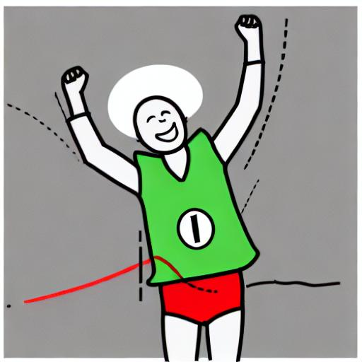<br>
      <code>Finish_depth_3.jpg</code>
    </td>
    <td align="center" valign="bottom">
      <br>
      <code>Finish_seg_1.jpg</code>
    </td>
  </tr>
  <tr>
    <td align="center" valign="bottom">
      <br>
      <code>Fish_depth_3.jpg</code>
    </td>
    <td align="center" valign="bottom">
      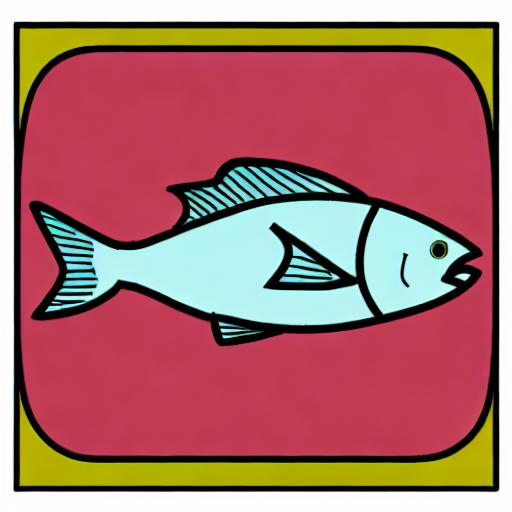<br>
      <code>Fish_seg_1.jpg</code>
    </td>
    <td align="center" valign="bottom">
      <br>
      <code>Fish_seg_2.jpg</code>
    </td>
  </tr>
  <tr>
    <td align="center" valign="bottom">
      <br>
      <code>Frida_depth_1.jpg</code>
    </td>
    <td align="center" valign="bottom">
      <br>
      <code>Frida_depth_2.jpg</code>
    </td>
    <td align="center" valign="bottom">
      <br>
      <code>Frida_depth_3.jpg</code>
    </td>
  </tr>
  <tr>
    <td align="center" valign="bottom">
      <br>
      <code>Friend_depth_1.jpg</code>
    </td>
    <td align="center" valign="bottom">
      <br>
      <code>Friend_openpose_2.jpg</code>
    </td>
    <td align="center" valign="bottom">
      <br>
      <code>Friend_openpose_3.jpg</code>
    </td>
  </tr>
  <tr>
    <td align="center" valign="bottom">
      <br>
      <code>Fruit_depth_1.jpg</code>
    </td>
    <td align="center" valign="bottom">
      <br>
      <code>Fruit_depth_2.jpg</code>
    </td>
    <td align="center" valign="bottom">
      <br>
      <code>Fruit_depth_3.jpg</code>
    </td>
  </tr>
  <tr>
    <td align="center" valign="bottom">
      <br>
      <code>Give_canny_2.jpg</code>
    </td>
    <td align="center" valign="bottom">
      <br>
      <code>Give_depth_1.jpg</code>
    </td>
    <td align="center" valign="bottom">
      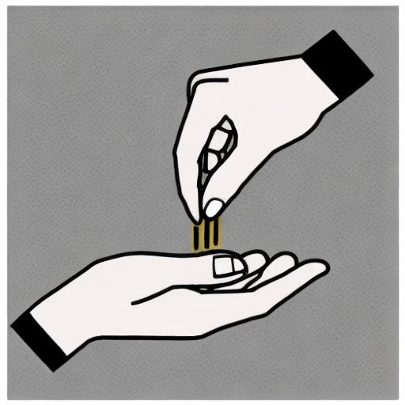<br>
      <code>Give_depth_2.jpg</code>
    </td>
  </tr>
  <tr>
    <td align="center" valign="bottom">
      <br>
      <code>Go_canny_1.jpg</code>
    </td>
    <td align="center" valign="bottom">
      <br>
      <code>Go_depth_2.jpg</code>
    </td>
    <td align="center" valign="bottom">
      <br>
      <code>Go_hed_3.jpg</code>
    </td>
  </tr>
  <tr>
    <td align="center" valign="bottom">
      <br>
      <code>Good_canny_2.jpg</code>
    </td>
    <td align="center" valign="bottom">
      <br>
      <code>Good_seg_1.jpg</code>
    </td>
    <td align="center" valign="bottom">
      <br>
      <code>Good_seg_3.jpg</code>
    </td>
  </tr>
  <tr>
    <td align="center" valign="bottom">
      <br>
      <code>Goodbye_openpose_1.jpg</code>
    </td>
    <td align="center" valign="bottom">
      <br>
      <code>Goodbye_openpose_2.jpg</code>
    </td>
    <td align="center" valign="bottom">
      <br>
      <code>Goodbye_openpose_3.jpg</code>
    </td>
  </tr>
  <tr>
    <td align="center" valign="bottom">
      <br>
      <code>Grandfather_seg_1.jpg</code>
    </td>
    <td align="center" valign="bottom">
      <br>
      <code>Grandfather_seg_2.jpg</code>
    </td>
    <td align="center" valign="bottom">
      <br>
      <code>Grandfather_seg_3.jpg</code>
    </td>
  </tr>
  <tr>
    <td align="center" valign="bottom">
      <br>
      <code>Grandmother_depth_1.jpg</code>
    </td>
    <td align="center" valign="bottom">
      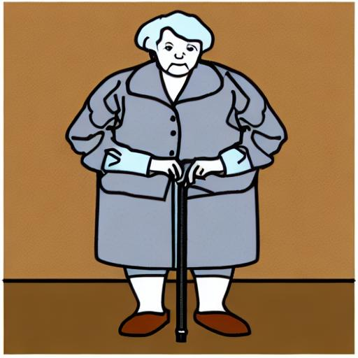<br>
      <code>Grandmother_hed_2.jpg</code>
    </td>
    <td align="center" valign="bottom">
      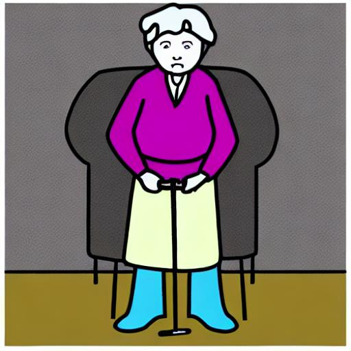<br>
      <code>Grandmother_seg_3.jpg</code>
    </td>
  </tr>
  <tr>
    <td align="center" valign="bottom">
      <br>
      <code>Happy_canny_1.jpg</code>
    </td>
    <td align="center" valign="bottom">
      <br>
      <code>Happy_depth_2.jpg</code>
    </td>
    <td align="center" valign="bottom">
      <br>
      <code>Happy_openpose_3.jpg</code>
    </td>
  </tr>
  <tr>
    <td align="center" valign="bottom">
      <br>
      <code>Hello_depth_2.jpg</code>
    </td>
    <td align="center" valign="bottom">
      <br>
      <code>Hello_seg_1.jpg</code>
    </td>
    <td align="center" valign="bottom">
      <br>
      <code>Hello_seg_1_dup1.jpg</code>
    </td>
  </tr>
  <tr>
    <td align="center" valign="bottom">
      <br>
      <code>Help_openpose_1.jpg</code>
    </td>
    <td align="center" valign="bottom">
      <br>
      <code>Help_openpose_2.jpg</code>
    </td>
    <td align="center" valign="bottom">
      <br>
      <code>Help_openpose_3.jpg</code>
    </td>
  </tr>
  <tr>
    <td align="center" valign="bottom">
      <br>
      <code>Hospital_depth_1.jpg</code>
    </td>
    <td align="center" valign="bottom">
      <br>
      <code>Hospital_hed_1.jpg</code>
    </td>
    <td align="center" valign="bottom">
      <br>
      <code>Hospital_hed_2.jpg</code>
    </td>
  </tr>
  <tr>
    <td align="center" valign="bottom">
      <br>
      <code>House_depth_1.jpg</code>
    </td>
    <td align="center" valign="bottom">
      <br>
      <code>House_hed_1.jpg</code>
    </td>
    <td align="center" valign="bottom">
      <br>
      <code>House_hed_2.jpg</code>
    </td>
  </tr>
  <tr>
    <td align="center" valign="bottom">
      <br>
      <code>Hungry_canny_1.jpg</code>
    </td>
    <td align="center" valign="bottom">
      <br>
      <code>Hungry_canny_2.jpg</code>
    </td>
    <td align="center" valign="bottom">
      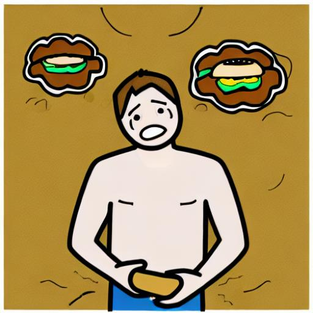<br>
      <code>Hungry_canny_3.jpg</code>
    </td>
  </tr>
  <tr>
    <td align="center" valign="bottom">
      <br>
      <code>Juice_depth_1.jpg</code>
    </td>
    <td align="center" valign="bottom">
      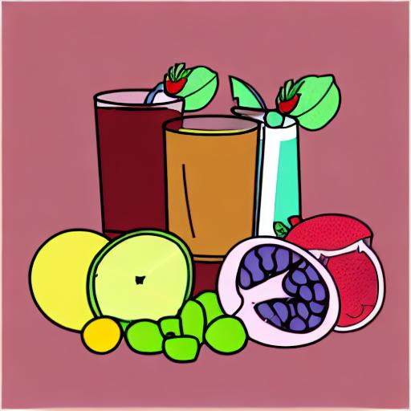<br>
      <code>Juice_depth_1_dup.jpg</code>
    </td>
    <td align="center" valign="bottom">
      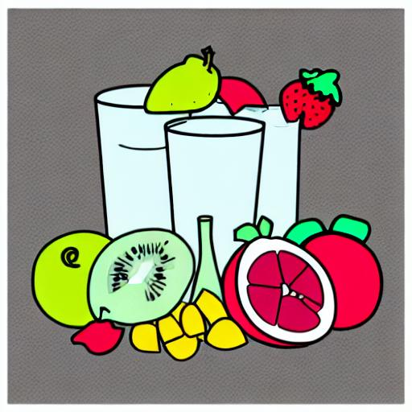<br>
      <code>Juice_depth_2.jpg</code>
    </td>
  </tr>
  <tr>
    <td align="center" valign="bottom">
      <br>
      <code>Jump_depth_1.jpg</code>
    </td>
    <td align="center" valign="bottom">
      <br>
      <code>Jump_seg_2.jpg</code>
    </td>
    <td align="center" valign="bottom">
      <br>
      <code>Jump_seg_3.jpg</code>
    </td>
  </tr>
  <tr>
    <td align="center" valign="bottom">
      <br>
      <code>Later_hed_1.jpg</code>
    </td>
    <td align="center" valign="bottom">
      <br>
      <code>Later_hed_2.jpg</code>
    </td>
    <td align="center" valign="bottom">
      <br>
      <code>Later_hed_3.jpg</code>
    </td>
  </tr>
  <tr>
    <td align="center" valign="bottom">
      <br>
      <code>Listen_depth_2.jpg</code>
    </td>
    <td align="center" valign="bottom">
      <br>
      <code>Listen_hed_1.jpg</code>
    </td>
    <td align="center" valign="bottom">
      <br>
      <code>Listen_seg_3.jpg</code>
    </td>
  </tr>
  <tr>
    <td align="center" valign="bottom">
      <br>
      <code>Look_depth_1.jpg</code>
    </td>
    <td align="center" valign="bottom">
      <br>
      <code>Look_hed_2_dup1.jpg</code>
    </td>
    <td align="center" valign="bottom">
      <br>
      <code>Look_hed_3.jpg</code>
    </td>
  </tr>
  <tr>
    <td align="center" valign="bottom">
      <br>
      <code>Love_depth_1.jpg</code>
    </td>
    <td align="center" valign="bottom">
      <br>
      <code>Love_depth_2.jpg</code>
    </td>
    <td align="center" valign="bottom">
      <br>
      <code>Love_depth_3.jpg</code>
    </td>
  </tr>
  <tr>
    <td align="center" valign="bottom">
      <br>
      <code>Mariachi_depth_2.jpg</code>
    </td>
    <td align="center" valign="bottom">
      <br>
      <code>Mariachi_depth_3.jpg</code>
    </td>
    <td align="center" valign="bottom">
      <br>
      <code>Mariachi_hed_1.jpg</code>
    </td>
  </tr>
  <tr>
    <td align="center" valign="bottom">
      <br>
      <code>Me_canny_3.jpg</code>
    </td>
    <td align="center" valign="bottom">
      <br>
      <code>Me_depth_2.jpg</code>
    </td>
    <td align="center" valign="bottom">
      <br>
      <code>Me_hed_1.jpg</code>
    </td>
  </tr>
  <tr>
    <td align="center" valign="bottom">
      <br>
      <code>Meat_depth_3.jpg</code>
    </td>
    <td align="center" valign="bottom">
      <br>
      <code>Meat_seg_1.jpg</code>
    </td>
    <td align="center" valign="bottom">
      <br>
      <code>Meat_seg_2.jpg</code>
    </td>
  </tr>
  <tr>
    <td align="center" valign="bottom">
      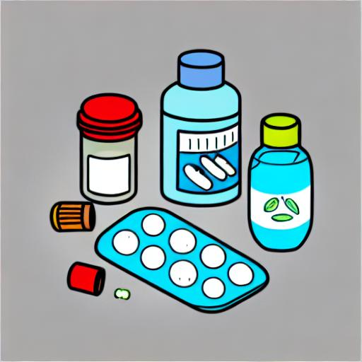<br>
      <code>Medicine_depth_3.jpg</code>
    </td>
    <td align="center" valign="bottom">
      <br>
      <code>Medicine_hed_1.jpg</code>
    </td>
    <td align="center" valign="bottom">
      <br>
      <code>Medicine_hed_2.jpg</code>
    </td>
  </tr>
  <tr>
    <td align="center" valign="bottom">
      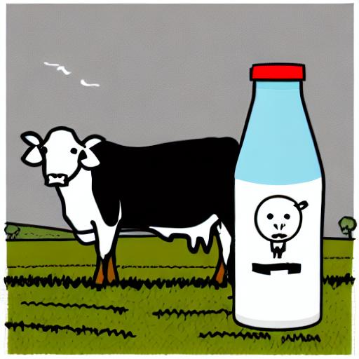<br>
      <code>Milk_canny_3.jpg</code>
    </td>
    <td align="center" valign="bottom">
      <br>
      <code>Milk_hed_2.jpg</code>
    </td>
    <td align="center" valign="bottom">
      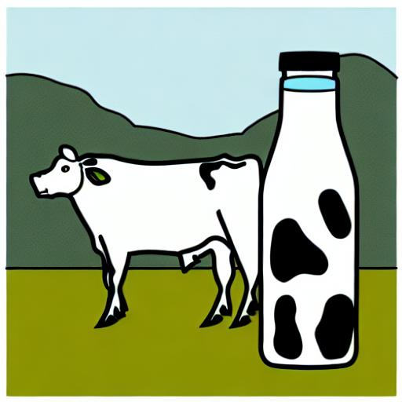<br>
      <code>Milk_seg_1.jpg</code>
    </td>
  </tr>
  <tr>
    <td align="center" valign="bottom">
      <br>
      <code>More_canny_2.jpg</code>
    </td>
    <td align="center" valign="bottom">
      <br>
      <code>More_canny_2_dup.jpg</code>
    </td>
    <td align="center" valign="bottom">
      <br>
      <code>More_seg_1.jpg</code>
    </td>
  </tr>
  <tr>
    <td align="center" valign="bottom">
      <br>
      <code>Mother_depth_3.jpg</code>
    </td>
    <td align="center" valign="bottom">
      <br>
      <code>Mother_hed_1.jpg</code>
    </td>
    <td align="center" valign="bottom">
      <br>
      <code>Mother_hed_2.jpg</code>
    </td>
  </tr>
  <tr>
    <td align="center" valign="bottom">
      <br>
      <code>No_canny_3.jpg</code>
    </td>
    <td align="center" valign="bottom">
      <br>
      <code>No_depth_1.jpg</code>
    </td>
    <td align="center" valign="bottom">
      <br>
      <code>No_hed_2.jpg</code>
    </td>
  </tr>
  <tr>
    <td align="center" valign="bottom">
      <br>
      <code>Now_depth_1.jpg</code>
    </td>
    <td align="center" valign="bottom">
      <br>
      <code>Now_depth_2.jpg</code>
    </td>
    <td align="center" valign="bottom">
      <br>
      <code>Now_depth_3.jpg</code>
    </td>
  </tr>
  <tr>
    <td align="center" valign="bottom">
      <br>
      <code>Open_canny_1.jpg</code>
    </td>
    <td align="center" valign="bottom">
      <br>
      <code>Open_depth_2.jpg</code>
    </td>
    <td align="center" valign="bottom">
      <br>
      <code>Open_hed_1.jpg</code>
    </td>
  </tr>
  <tr>
    <td align="center" valign="bottom">
      <br>
      <code>Pain_depth_1.jpg</code>
    </td>
    <td align="center" valign="bottom">
      <br>
      <code>Pain_depth_2.jpg</code>
    </td>
    <td align="center" valign="bottom">
      <br>
      <code>Pain_depth_2_dup.jpg</code>
    </td>
  </tr>
  <tr>
    <td align="center" valign="bottom">
      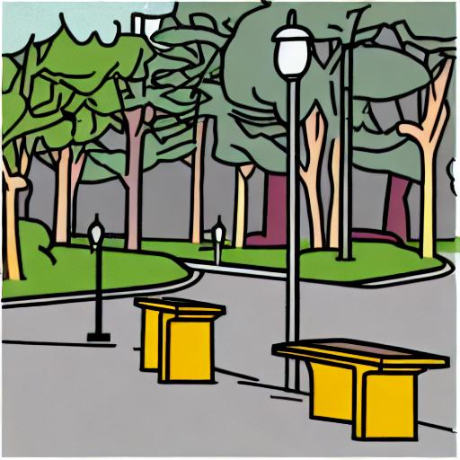<br>
      <code>Park_depth_2.jpg</code>
    </td>
    <td align="center" valign="bottom">
      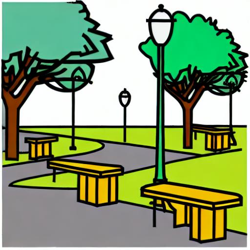<br>
      <code>Park_seg_1.jpg</code>
    </td>
    <td align="center" valign="bottom">
      <br>
      <code>Park_seg_3.jpg</code>
    </td>
  </tr>
  <tr>
    <td align="center" valign="bottom">
      <br>
      <code>People_seg_1.jpg</code>
    </td>
    <td align="center" valign="bottom">
      <br>
      <code>People_seg_2.jpg</code>
    </td>
    <td align="center" valign="bottom">
      <br>
      <code>People_seg_3.jpg</code>
    </td>
  </tr>
  <tr>
    <td align="center" valign="bottom">
      <br>
      <code>Phone_canny_3.jpg</code>
    </td>
    <td align="center" valign="bottom">
      <br>
      <code>Phone_depth_1.jpg</code>
    </td>
    <td align="center" valign="bottom">
      <br>
      <code>Phone_depth_2.jpg</code>
    </td>
  </tr>
  <tr>
    <td align="center" valign="bottom">
      <br>
      <code>Pinata_depth_2.jpg</code>
    </td>
    <td align="center" valign="bottom">
      <br>
      <code>Pinata_depth_3.jpg</code>
    </td>
    <td align="center" valign="bottom">
      <br>
      <code>Pinata_hed_1.jpg</code>
    </td>
  </tr>
  <tr>
    <td align="center" valign="bottom">
      <br>
      <code>Play_canny_1.jpg</code>
    </td>
    <td align="center" valign="bottom">
      <br>
      <code>Play_canny_2.jpg</code>
    </td>
    <td align="center" valign="bottom">
      <br>
      <code>Play_canny_3.jpg</code>
    </td>
  </tr>
  <tr>
    <td align="center" valign="bottom">
      <br>
      <code>Playground_canny_1.jpg</code>
    </td>
    <td align="center" valign="bottom">
      <br>
      <code>Playground_canny_2.jpg</code>
    </td>
    <td align="center" valign="bottom">
      <br>
      <code>Playground_depth_3.jpg</code>
    </td>
  </tr>
  <tr>
    <td align="center" valign="bottom">
      <br>
      <code>Please_depth_1.jpg</code>
    </td>
    <td align="center" valign="bottom">
      <br>
      <code>Please_depth_2.jpg</code>
    </td>
    <td align="center" valign="bottom">
      <br>
      <code>Please_depth_3.jpg</code>
    </td>
  </tr>
  <tr>
    <td align="center" valign="bottom">
      <br>
      <code>Pozole_canny_1.jpg</code>
    </td>
    <td align="center" valign="bottom">
      <br>
      <code>Pozole_canny_2.jpg</code>
    </td>
    <td align="center" valign="bottom">
      <br>
      <code>Pozole_hed_1.jpg</code>
    </td>
  </tr>
  <tr>
    <td align="center" valign="bottom">
      <br>
      <code>Rest_depth_1.jpg</code>
    </td>
    <td align="center" valign="bottom">
      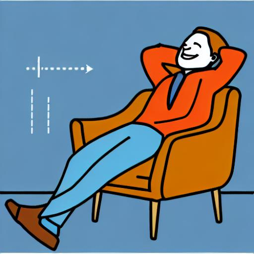<br>
      <code>Rest_depth_2.jpg</code>
    </td>
    <td align="center" valign="bottom">
      <br>
      <code>Rest_openpose_3.jpg</code>
    </td>
  </tr>
  <tr>
    <td align="center" valign="bottom">
      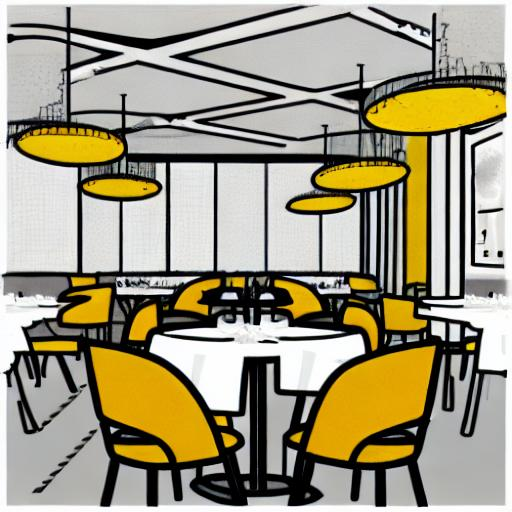<br>
      <code>Restaurant_canny_2.jpg</code>
    </td>
    <td align="center" valign="bottom">
      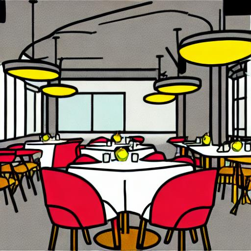<br>
      <code>Restaurant_depth_1.jpg</code>
    </td>
    <td align="center" valign="bottom">
      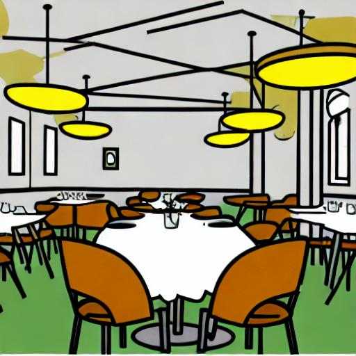<br>
      <code>Restaurant_depth_2.jpg</code>
    </td>
  </tr>
  <tr>
    <td align="center" valign="bottom">
      <br>
      <code>Rice_canny_3.jpg</code>
    </td>
    <td align="center" valign="bottom">
      <br>
      <code>Rice_depth_2.jpg</code>
    </td>
    <td align="center" valign="bottom">
      <br>
      <code>Rice_hed_1.jpg</code>
    </td>
  </tr>
  <tr>
    <td align="center" valign="bottom">
      <br>
      <code>Run_openpose_1.jpg</code>
    </td>
    <td align="center" valign="bottom">
      <br>
      <code>Run_openpose_2.jpg</code>
    </td>
    <td align="center" valign="bottom">
      <br>
      <code>Run_seg_1.jpg</code>
    </td>
  </tr>
  <tr>
    <td align="center" valign="bottom">
      <br>
      <code>Sad_depth_1.jpg</code>
    </td>
    <td align="center" valign="bottom">
      <br>
      <code>Sad_hed_1.jpg</code>
    </td>
    <td align="center" valign="bottom">
      <br>
      <code>Sad_openpose_1.jpg</code>
    </td>
  </tr>
  <tr>
    <td align="center" valign="bottom">
      <br>
      <code>Scared_depth_1.jpg</code>
    </td>
    <td align="center" valign="bottom">
      <br>
      <code>Scared_depth_2.jpg</code>
    </td>
    <td align="center" valign="bottom">
      <br>
      <code>Scared_depth_3.jpg</code>
    </td>
  </tr>
  <tr>
    <td align="center" valign="bottom">
      <br>
      <code>School_canny_1.jpg</code>
    </td>
    <td align="center" valign="bottom">
      <br>
      <code>School_depth_2.jpg</code>
    </td>
    <td align="center" valign="bottom">
      <br>
      <code>School_depth_3.jpg</code>
    </td>
  </tr>
  <tr>
    <td align="center" valign="bottom">
      <br>
      <code>Shower_canny_1.jpg</code>
    </td>
    <td align="center" valign="bottom">
      <br>
      <code>Shower_canny_2.jpg</code>
    </td>
    <td align="center" valign="bottom">
      <br>
      <code>Shower_hed_3.jpg</code>
    </td>
  </tr>
  <tr>
    <td align="center" valign="bottom">
      <br>
      <code>Sick_canny_1.jpg</code>
    </td>
    <td align="center" valign="bottom">
      <br>
      <code>Sick_hed_2.jpg</code>
    </td>
    <td align="center" valign="bottom">
      <br>
      <code>Sick_hed_3.jpg</code>
    </td>
  </tr>
  <tr>
    <td align="center" valign="bottom">
      <br>
      <code>Sister_depth_2.jpg</code>
    </td>
    <td align="center" valign="bottom">
      <br>
      <code>Sister_openpose_1.jpg</code>
    </td>
    <td align="center" valign="bottom">
      <br>
      <code>Sister_openpose_3.jpg</code>
    </td>
  </tr>
  <tr>
    <td align="center" valign="bottom">
      <br>
      <code>Sleep_depth_1.jpg</code>
    </td>
    <td align="center" valign="bottom">
      <br>
      <code>Sleep_depth_2.jpg</code>
    </td>
    <td align="center" valign="bottom">
      <br>
      <code>Sleep_depth_3.jpg</code>
    </td>
  </tr>
  <tr>
    <td align="center" valign="bottom">
      <br>
      <code>Soup_seg_1.jpg</code>
    </td>
    <td align="center" valign="bottom">
      <br>
      <code>Soup_seg_2.jpg</code>
    </td>
    <td align="center" valign="bottom">
      <br>
      <code>Soup_seg_3.jpg</code>
    </td>
  </tr>
  <tr>
    <td align="center" valign="bottom">
      <br>
      <code>Stop_hed_1.jpg</code>
    </td>
    <td align="center" valign="bottom">
      <br>
      <code>Stop_hed_2.jpg</code>
    </td>
    <td align="center" valign="bottom">
      <br>
      <code>Stop_hed_3.jpg</code>
    </td>
  </tr>
  <tr>
    <td align="center" valign="bottom">
      <br>
      <code>Store_depth_3.jpg</code>
    </td>
    <td align="center" valign="bottom">
      <br>
      <code>Store_hed_1.jpg</code>
    </td>
    <td align="center" valign="bottom">
      <br>
      <code>Store_seg_2.jpg</code>
    </td>
  </tr>
  <tr>
    <td align="center" valign="bottom">
      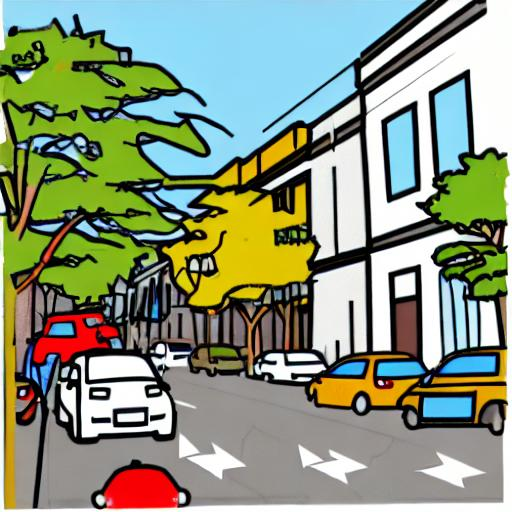<br>
      <code>Street_canny_1.jpg</code>
    </td>
    <td align="center" valign="bottom">
      <br>
      <code>Street_seg_2.jpg</code>
    </td>
    <td align="center" valign="bottom">
      <br>
      <code>Street_seg_3.jpg</code>
    </td>
  </tr>
  <tr>
    <td align="center" valign="bottom">
      <br>
      <code>Surprise_depth_1.jpg</code>
    </td>
    <td align="center" valign="bottom">
      <br>
      <code>Surprise_seg_2.jpg</code>
    </td>
    <td align="center" valign="bottom">
      <br>
      <code>Surprise_seg_3.jpg</code>
    </td>
  </tr>
  <tr>
    <td align="center" valign="bottom">
      <br>
      <code>Taco_depth_1.jpg</code>
    </td>
    <td align="center" valign="bottom">
      <br>
      <code>Taco_depth_2.jpg</code>
    </td>
    <td align="center" valign="bottom">
      <br>
      <code>Taco_depth_2_dup.jpg</code>
    </td>
  </tr>
  <tr>
    <td align="center" valign="bottom">
      <br>
      <code>Take_canny_3.jpg</code>
    </td>
    <td align="center" valign="bottom">
      <br>
      <code>Take_depth_1.jpg</code>
    </td>
    <td align="center" valign="bottom">
      <br>
      <code>Take_depth_2.jpg</code>
    </td>
  </tr>
  <tr>
    <td align="center" valign="bottom">
      <br>
      <code>Talk_canny_1.jpg</code>
    </td>
    <td align="center" valign="bottom">
      <br>
      <code>Talk_depth_2.jpg</code>
    </td>
    <td align="center" valign="bottom">
      <br>
      <code>Talk_seg_3.jpg</code>
    </td>
  </tr>
  <tr>
    <td align="center" valign="bottom">
      <br>
      <code>Teacher_canny_3.jpg</code>
    </td>
    <td align="center" valign="bottom">
      <br>
      <code>Teacher_depth_1.jpg</code>
    </td>
    <td align="center" valign="bottom">
      <br>
      <code>Teacher_openpose_2.jpg</code>
    </td>
  </tr>
  <tr>
    <td align="center" valign="bottom">
      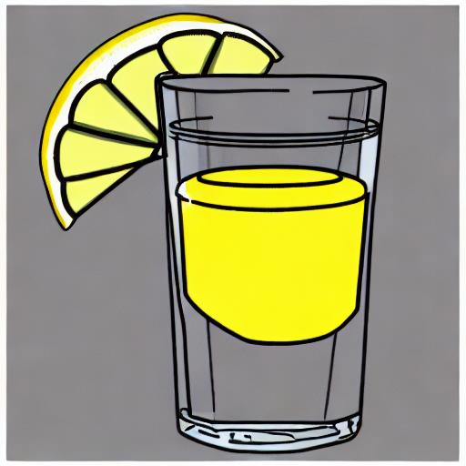<br>
      <code>Tequila_canny_2.jpg</code>
    </td>
    <td align="center" valign="bottom">
      <br>
      <code>Tequila_depth_1.jpg</code>
    </td>
    <td align="center" valign="bottom">
      <br>
      <code>Tequila_hed_1.jpg</code>
    </td>
  </tr>
  <tr>
    <td align="center" valign="bottom">
      <br>
      <code>Thank_you_depth_1.jpg</code>
    </td>
    <td align="center" valign="bottom">
      <br>
      <code>Thank_you_depth_1_dup.jpg</code>
    </td>
    <td align="center" valign="bottom">
      <br>
      <code>Thank_you_hed_2.jpg</code>
    </td>
  </tr>
  <tr>
    <td align="center" valign="bottom">
      <br>
      <code>Thirsty_hed_1.jpg</code>
    </td>
    <td align="center" valign="bottom">
      <br>
      <code>Thirsty_hed_2.jpg</code>
    </td>
    <td align="center" valign="bottom">
      <br>
      <code>Thirsty_hed_3.jpg</code>
    </td>
  </tr>
  <tr>
    <td align="center" valign="bottom">
      <br>
      <code>Tired_canny_3.jpg</code>
    </td>
    <td align="center" valign="bottom">
      <br>
      <code>Tired_depth_2.jpg</code>
    </td>
    <td align="center" valign="bottom">
      <br>
      <code>Tired_hed_1.jpg</code>
    </td>
  </tr>
  <tr>
    <td align="center" valign="bottom">
      <br>
      <code>Toilet_depth_2.jpg</code>
    </td>
    <td align="center" valign="bottom">
      <br>
      <code>Toilet_hed_1.jpg</code>
    </td>
    <td align="center" valign="bottom">
      <br>
      <code>Toilet_seg_1.jpg</code>
    </td>
  </tr>
  <tr>
    <td align="center" valign="bottom">
      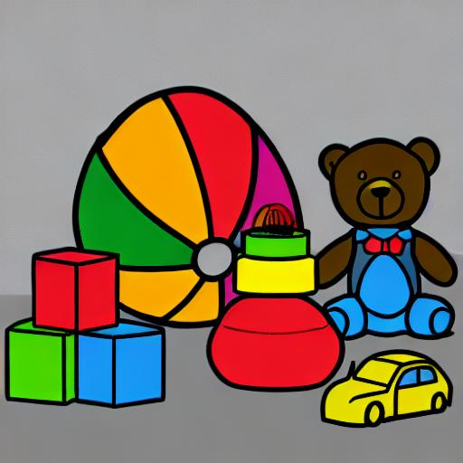<br>
      <code>Toy_canny_1.jpg</code>
    </td>
    <td align="center" valign="bottom">
      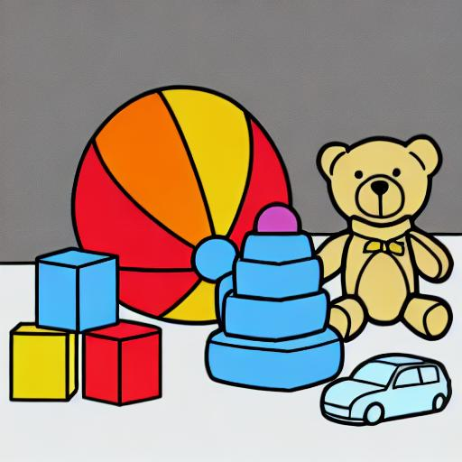<br>
      <code>Toy_canny_2.jpg</code>
    </td>
    <td align="center" valign="bottom">
      <br>
      <code>Toy_canny_3.jpg</code>
    </td>
  </tr>
  <tr>
    <td align="center" valign="bottom">
      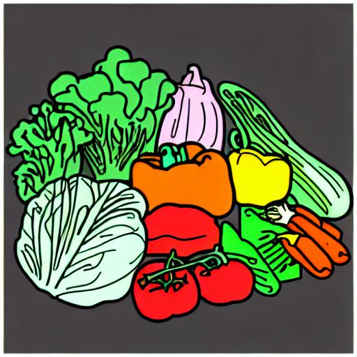<br>
      <code>Vegetables_hed_1.jpg</code>
    </td>
    <td align="center" valign="bottom">
      <br>
      <code>Vegetables_hed_1_dup.jpg</code>
    </td>
    <td align="center" valign="bottom">
      <br>
      <code>Vegetables_hed_2.jpg</code>
    </td>
  </tr>
  <tr>
    <td align="center" valign="bottom">
      <br>
      <code>Wait_canny_1.jpg</code>
    </td>
    <td align="center" valign="bottom">
      <br>
      <code>Wait_depth_2.jpg</code>
    </td>
    <td align="center" valign="bottom">
      <br>
      <code>Wait_depth_3.jpg</code>
    </td>
  </tr>
  <tr>
    <td align="center" valign="bottom">
      <br>
      <code>Wake_up_depth_2.jpg</code>
    </td>
    <td align="center" valign="bottom">
      <br>
      <code>Wake_up_hed_1.jpg</code>
    </td>
    <td align="center" valign="bottom">
      <br>
      <code>Wake_up_hed_3.jpg</code>
    </td>
  </tr>
  <tr>
    <td align="center" valign="bottom">
      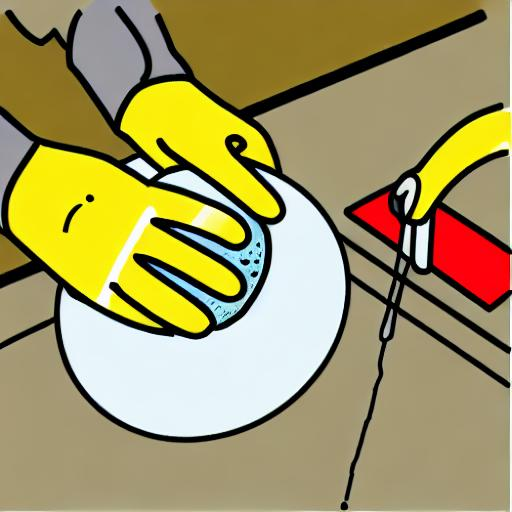<br>
      <code>Wash_depth_1.jpg</code>
    </td>
    <td align="center" valign="bottom">
      <br>
      <code>Wash_depth_2.jpg</code>
    </td>
    <td align="center" valign="bottom">
      <br>
      <code>Wash_depth_3.jpg</code>
    </td>
  </tr>
  <tr>
    <td align="center" valign="bottom">
      <br>
      <code>Water_canny_2.jpg</code>
    </td>
    <td align="center" valign="bottom">
      <br>
      <code>Water_depth_1.jpg</code>
    </td>
    <td align="center" valign="bottom">
      <br>
      <code>Water_seg_3.jpg</code>
    </td>
  </tr>
  <tr>
    <td align="center" valign="bottom">
      <br>
      <code>What_canny_2.jpg</code>
    </td>
    <td align="center" valign="bottom">
      <br>
      <code>What_hed_1.jpg</code>
    </td>
    <td align="center" valign="bottom">
      <br>
      <code>What_hed_3.jpg</code>
    </td>
  </tr>
  <tr>
    <td align="center" valign="bottom">
      <br>
      <code>When_edge_2.jpg</code>
    </td>
    <td align="center" valign="bottom">
      <br>
      <code>When_hed_3.jpg</code>
    </td>
    <td align="center" valign="bottom">
      <br>
      <code>When_seg_1.jpg</code>
    </td>
  </tr>
  <tr>
    <td align="center" valign="bottom">
      <br>
      <code>Where_canny_1.jpg</code>
    </td>
    <td align="center" valign="bottom">
      <br>
      <code>Where_canny_2.jpg</code>
    </td>
    <td align="center" valign="bottom">
      <br>
      <code>Where_canny_3.jpg</code>
    </td>
  </tr>
  <tr>
    <td align="center" valign="bottom">
      <br>
      <code>Who_canny_2.jpg</code>
    </td>
    <td align="center" valign="bottom">
      <br>
      <code>Who_depth_3.jpg</code>
    </td>
    <td align="center" valign="bottom">
      <br>
      <code>Who_hed_1.jpg</code>
    </td>
  </tr>
  <tr>
    <td align="center" valign="bottom">
      <br>
      <code>Why_canny_1.jpg</code>
    </td>
    <td align="center" valign="bottom">
      <br>
      <code>Why_depth_2.jpg</code>
    </td>
    <td align="center" valign="bottom">
      <br>
      <code>Why_depth_3.jpg</code>
    </td>
  </tr>
  <tr>
    <td align="center" valign="bottom">
      <br>
      <code>Worried_depth_1.jpg</code>
    </td>
    <td align="center" valign="bottom">
      <br>
      <code>Worried_hed_2.jpg</code>
    </td>
    <td align="center" valign="bottom">
      <br>
      <code>Worried_hed_3.jpg</code>
    </td>
  </tr>
  <tr>
    <td align="center" valign="bottom">
      <br>
      <code>Yes_depth_1.jpg</code>
    </td>
    <td align="center" valign="bottom">
      <br>
      <code>Yes_depth_2.jpg</code>
    </td>
    <td align="center" valign="bottom">
      <br>
      <code>Yes_seg_3.jpg</code>
    </td>
  </tr>
  <tr>
    <td align="center" valign="bottom">
      <br>
      <code>You_canny_3.jpg</code>
    </td>
    <td align="center" valign="bottom">
      <br>
      <code>You_depth_1.jpg</code>
    </td>
    <td align="center" valign="bottom">
      <br>
      <code>You_depth_2.jpg</code>
    </td>
  </tr>
</table>

